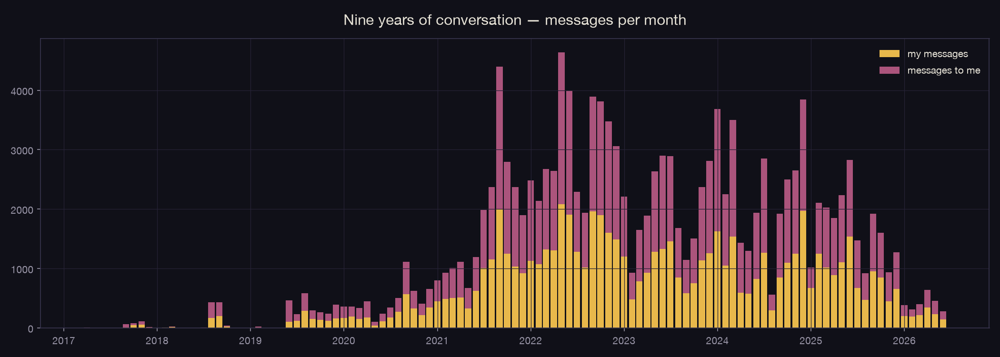
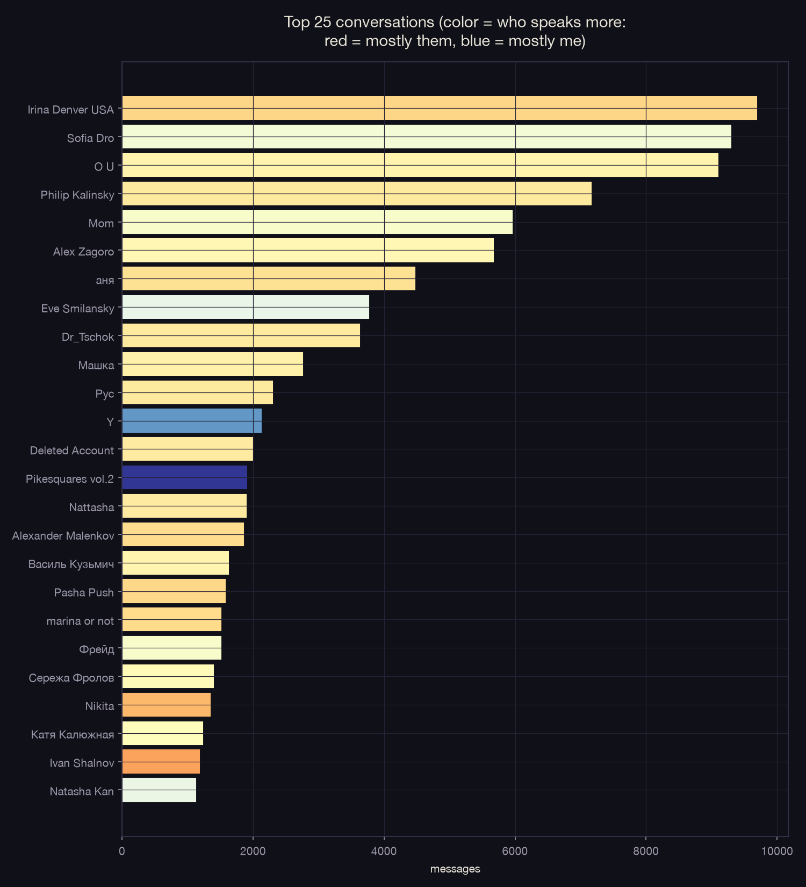
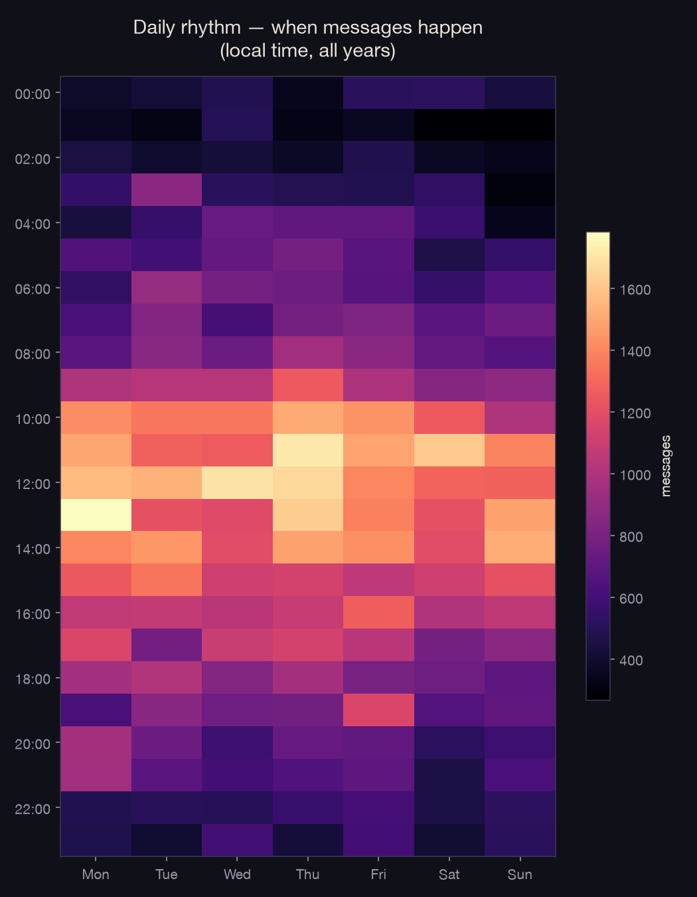
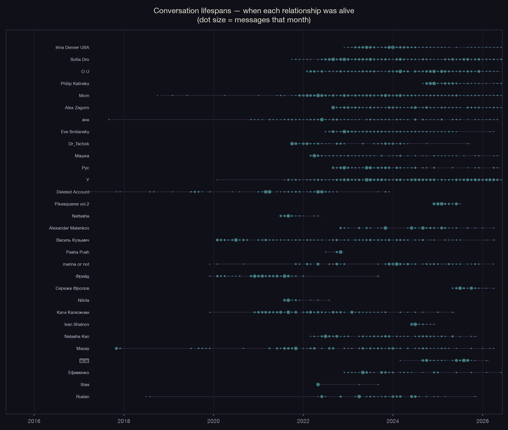
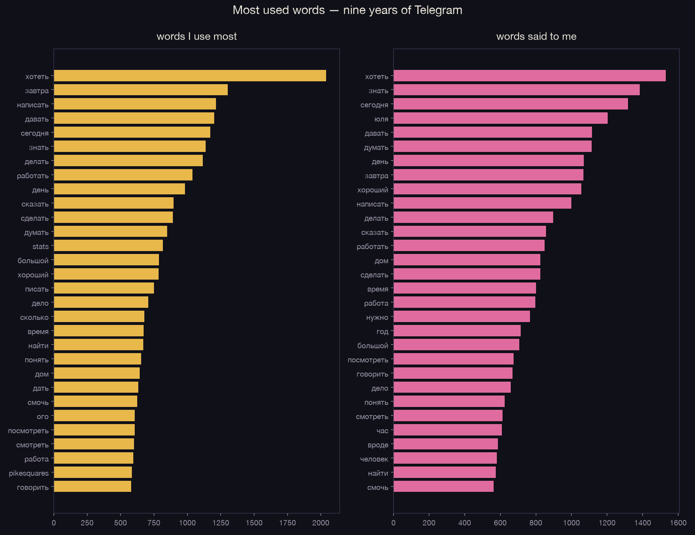
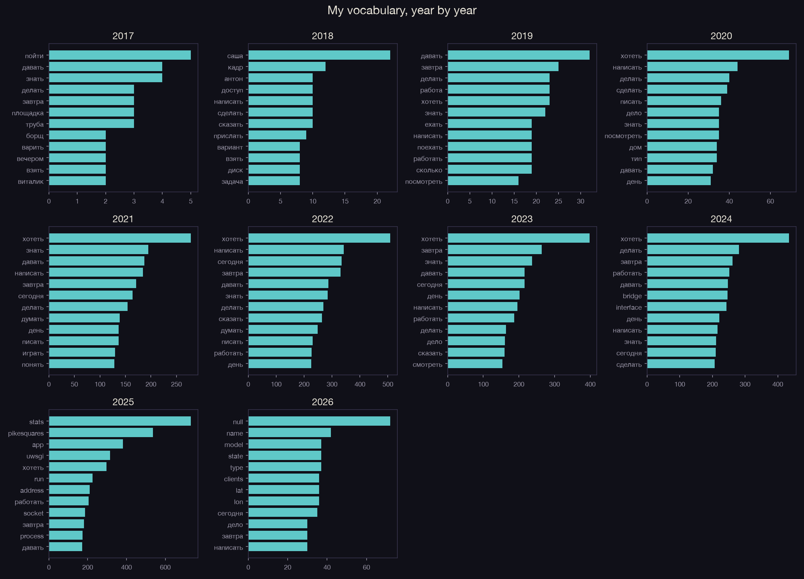

# Walkthrough — Phase 1: Foundation + Telegram

What was built, how it works, and what came out of it. Everything below ran on
June 12, 2026 against your real archive.

The headline numbers: **143,318 messages · 618 conversations · 539 people ·
April 2017 to June 2026**. You wrote 69,318 of them (48%).

---

## The architecture in one picture

```
~/Desktop/personal archive/raw/        <- exports go in, never modified
        |
   parsers/  (one script per source)
        |
~/Desktop/personal archive/processed/  <- clean Parquet tables
        |
   analysis/  +  art/  +  notebooks/
        |
~/Desktop/personal archive/visualizations/   <- charts + art pieces
```

Code lives in `~/dev/self data` (this repo). Data never leaves the Desktop
archive and never gets committed. Everything is local — no personal text
touches any cloud API. All paths live in one file, [config.py](../config.py),
so if the archive moves, you edit one line.

---

## Step 1 — Project scaffold

- `requirements.txt` — the full toolchain: `beautifulsoup4`/`lxml` (HTML
  parsing), `pandas` + `pyarrow` (data tables), `duckdb` (SQL over Parquet),
  `matplotlib` (charts), `pymorphy3` (Russian lemmatization), `jupyter`.
- `.venv/` — isolated Python 3.12 environment. Activate with
  `source .venv/bin/activate`.
- [config.py](../config.py) — every input and output path.

To set up from scratch on any machine:

```bash
cd ~/dev/self\ data
python3 -m venv .venv
.venv/bin/pip install -r requirements.txt
```

## Step 2 — Telegram parser

**Script:** [parsers/telegram.py](../parsers/telegram.py)
**Run:** `.venv/bin/python parsers/telegram.py` (~3.5 minutes)
**Output:** `processed/telegram_messages.parquet` — 143,318 rows

The Telegram export is 719 folders of paginated HTML (`messages.html`,
`messages2.html`, ...). The parser walks every folder and pulls, per message:

| column | meaning | where it comes from |
|---|---|---|
| `chat_name` | who the conversation is with | page header |
| `ts_local` / `ts_utc` | when, local and UTC | the `title` attr: `19.10.2021 17:31:10 UTC-05:00` |
| `sender` | who wrote it | `from_name` div; consecutive messages omit it, so the parser carries the last sender forward |
| `text` | the words | `text` div |
| `media_type` | photo / voice / sticker / call / ... | CSS classes on the message |
| `is_me` | did you write it | see below |
| `is_forwarded` | forwarded content | `forwarded body` marker |

**The "who am I" trick.** Telegram's export never says whose archive it is. So
the parser detects the owner statistically: the sender who speaks in the most
*distinct* chats. You ("Y") speak in 592 of 618 chats; the runner-up appears in
34. Unambiguous.

101 of the 719 folders contained no parseable messages (empty or
service-message-only chats), leaving 618 real conversations.

## Step 3 — Analysis charts

**Script:** [analysis/telegram_analysis.py](../analysis/telegram_analysis.py)
**Run:** `.venv/bin/python analysis/telegram_analysis.py`
**Output:** four PNGs in `visualizations/`

### Nine years of conversation



Messages per month, stacked: gold is you, pink is everyone else. The archive
is quiet until late 2019, builds through 2020, then erupts — late 2021 through
2022 is the loudest era of your life so far (peaking above 4,500 messages a
month), cooling into a steadier 2024–2026 rhythm.

### Top conversations



The 25 biggest relationships by volume. Color encodes who carries the
conversation: red means they write more, blue means you do.

### Daily rhythm



Hour-of-day × weekday, all nine years summed. Your messaging life is brightest
late morning to mid-afternoon, hottest pockets Monday and Thursday around
10:00–14:00, and goes dark at 01:00–04:00.

### Conversation lifespans



The 30 biggest relationships as horizontal timelines — dot size is messages
that month. You can see relationships ignite, breathe, pause, and resume:
which companions span the whole archive, and which burned bright in a single
season.

## Step 4 — Word histograms (RU + EN)

**Script:** [analysis/word_histograms.py](../analysis/word_histograms.py)
**Run:** `.venv/bin/python analysis/word_histograms.py`
**Output:** `processed/word_frequencies.parquet` (122,924 lemma×speaker×year
rows) + two PNGs

How a word becomes a count:

1. URLs are stripped (before this fix, "https" and "com" topped your list).
2. Text is lowercased and split into Cyrillic/Latin word tokens.
3. Russian words are **lemmatized** with pymorphy3 — думаю / думала / думаешь
   all collapse to *думать*, so the histogram counts ideas, not grammar.
4. RU + EN stopwords (function words, fillers like *ладно*, *okay*) are
   dropped, as are tokens under 3 letters.

### Your words vs. words said to you



Both sides of nine years share a #1 word: **хотеть** — to want. Your column
runs хотеть, завтра, написать, давать, сегодня, знать, делать, работать — a
vocabulary of intention and forward motion. The words said to you mirror it
closely, with **юля** (your name being called) high in theirs.

### Your vocabulary, year by year



Twelve top words per year, 2017–2026. This is where themes drift: work words
rise and fall, names enter and leave. The underlying
`word_frequencies.parquet` keeps every (word, speaker, year) count, so later
art pieces — word clouds, "the vocabulary of a relationship" — read from it
without recomputing.

## Step 5 — Interactive notebook

**File:** [notebooks/01_telegram.ipynb](../notebooks/01_telegram.ipynb)
(executed, outputs embedded)

Five cells, each a different way of asking questions:

1. Load the parquet tables, print the archive's vital signs.
2. Regenerate all four canonical charts inline.
3. **SQL over the archive** with DuckDB — the example finds your ten most
   intense conversation days ever; edit the query to ask anything.
4. **Single-relationship zoom**: set `PERSON` to any chat name and get its
   monthly shape (who wrote how much, when) plus the 25 words that define that
   specific relationship.
5. Word histograms inline, plus a one-word time machine: trace any word
   (default *работать*) through the years, your usage vs. theirs.

Open it with: `cd ~/dev/self\ data && .venv/bin/jupyter lab notebooks/01_telegram.ipynb`

## Step 6 — Relationship Constellations (art piece)

**Script:** [art/constellation.py](../art/constellation.py)
**Output:** `visualizations/constellation.html` — open it in any browser,
no server or internet needed (501 stars, 87 KB, data embedded)

Every conversation with at least 3 messages becomes a star in a night sky:

- **x** — when the relationship lived (the center of mass of all its
  messages, on a 2017–2026 axis with faint year gridlines)
- **y** — who carried it: stars near the top are relationships where they
  wrote more; near the bottom, you did
- **size** — total messages (log scale, so the giants don't drown the rest)
- **color** — lifespan: brief encounters burn blue-white, long companions
  glow gold
- **brightness** — recency: still-active relationships shine; ones silent
  for two years fade toward the dark, but never fully disappear

Stars twinkle gently; hover over any of them to see who it is, the message
count, the years, and how much of it was you.

## Meta-patterns — what the archive says when you step back

Computed from `word_frequencies.parquet` (word shares are per 10,000 words,
so years of different loudness compare fairly) and `telegram_messages.parquet`.
One caveat throughout: 2017 is only ~200 of your words, so its numbers are
anecdotes, not statistics.

### Work turned from a noun into a verb

The two work-words tell different stories. **работа** (work as a *thing* — a
job, a place) peaked in 2019 at 66 per 10k words, the highest any work-word
ever reached, then slowly faded — by 2025–26 it's at 16–18. **работать** (work
as an *activity*) moved the opposite way: it climbed steadily from 2021 (30)
through 2023 (42) to its peak in 2024 (50), and only then eased off. So the
feeling that работать "took over in 2021" is real, but it was a slow takeover
that crested in 2024 — and the deeper shift is grammatical: around 2020–2021,
work stopped being something you *talked about* and became something you
*were doing*.

### The chat became a workbench

Look at the top-8 words you wrote each year:

- 2018: саша, кадр, антон, доступ, прислать — names and logistics
- 2021–2023: хотеть, знать, завтра, сегодня, думать — pure intention
- 2024: bridge, interface enter the top 8
- 2025: stats, pikesquares, app, uwsgi, run, address — code outranks Russian
- 2026 (so far): null, name, model, state, lat, lon — literally JSON keys

Telegram absorbed your programming life. The boundary between *talking* and
*building* dissolved somewhere in 2024, and by 2025 your most-typed words are
addressed to machines as much as to people. (This also inflates работать's
late surge — and suggests a future refinement: separating "human voice" from
"code voice" before counting.)

### Wanting is quieting down

**хотеть** is the #1 word of the whole archive on both sides of the
conversation — but its intensity is falling: roughly 74–86 per 10k through
2020–2023, then 72 (2024), 53 (2025), 40 (2026). Half its former strength.
Maybe desires settled; maybe they stopped needing to be said; maybe the
workbench years just leave less room for them. The histogram can't say which —
but it's the clearest single trendline in your vocabulary.

### 2021–2022 was a big bang of people

New conversations started per year: 7, 17, 48, 37, then **146 in 2021 and 188
in 2022**, then straight back down to ~35. Two years brought in more new
people than the other eight combined. Message volume peaked in the same era
(your loudest months, above 4,500). Whatever happened then — new city, new
scene, new work — the archive records it as a population explosion followed by
consolidation: after 2022 you mostly *deepened* existing relationships instead
of starting new ones.

### Half of all relationships are sparks

Of 618 conversations: **286 lasted under a month**, 149 lived between a month
and a year, 142 became companions of more than a year, and 33 have spanned
over four years. That's the metabolism of a social life made visible — for
every long companion there are two brief encounters that never caught fire.
(In the constellation these are the blue-white stars.)

### You used to listen; now you lead

Your share of all messages written, year by year: 39% (2017) → 43% → 43% →
50% (2020) → ~48–49% through 2023 → 45% in 2024 (your most listening year
since 2019) → **52% in 2025 and 54% in 2026** — the first time in the archive
you consistently out-write everyone who writes to you.

### 2023 was the tired year

Three words all peak in 2023 simultaneously: **устать** (tired, 5.1 per 10k —
double its usual level), **спать** (sleep, 17.6), and — unexpectedly —
**любить** (love, 10.3, its all-time high). Fatigue, sleep, and love cresting
together in one year is the kind of pattern the daily logs (mood, energy)
will eventually let you confirm or complicate. And **дом** (home) had its own
peak earlier — 45 per 10k in 2020, the pandemic year, when home was suddenly
everything.

### The vocabulary of intention, refined

"Intention and forward motion" holds up, but the data sharpens it: your
dominant words are almost all *verbs of near-future action* — хотеть, написать,
давать, делать, сделать, работать — anchored by *tomorrow* (завтра), which
beats *today* (сегодня) in most years. Meanwhile feeling-words barely register:
любить never breaks 11 per 10k even at its peak. Your Telegram voice plans,
promises, and builds; it rarely declares. Whether the feelings lived elsewhere
— in person, in silence, in images — is exactly the kind of question the rest
of the archive (diaries, daily logs, Flo, calendar) exists to answer.

---

## Where things stand

Done (Phase 1): scaffold, Telegram parser, analysis charts + word
histograms, interactive notebook, constellation art piece.

Next passes, in plan order:

- **Gmail**: streaming parser for the 7.6 GB mbox (metadata for all mail,
  bodies for sent mail), then the same word pipeline for your email voice
- **Calendar + Maps**: `.ics` and JSON parsers into the unified timeline
- **people.yaml**: one registry mapping Telegram names ↔ email addresses,
  the backbone for cross-source relationship views
- **Daily logs**: schema + intake for your Google Forms practice
- **Weekly data portraits**: the semi-automated Dear Data pages

## Rerunning everything

```bash
cd ~/dev/self\ data
.venv/bin/python parsers/telegram.py            # after a fresh Telegram export
.venv/bin/python analysis/telegram_analysis.py
.venv/bin/python analysis/word_histograms.py
.venv/bin/python art/constellation.py
```

Each script is idempotent: it reads raw, overwrites processed outputs, and
never touches the export itself.
